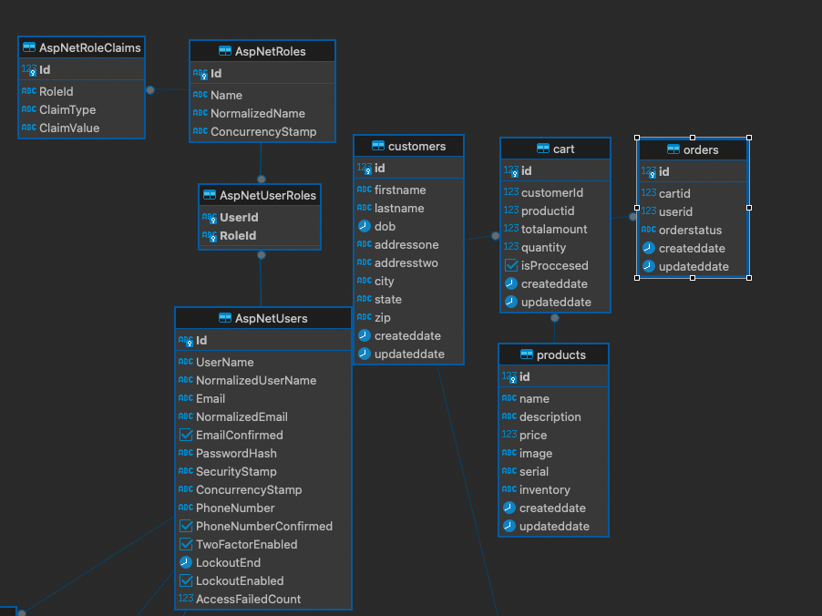

# Capstone project

# Product Requirements Documentation

- **Developer: Yuliya Buiko**
- **App Name: E-Commerce App**
- **Description: Back-end for a full-stack ecommerce web application. The system should have an interface to list products for sale, inserting and updating products, adding products to cart, completing purchases, see fulfilment status, it should also offer a method for searching products and tracking inventory.**
- **GitHub Url Back End: https://github.com/uliaarkadz/BE_CAPSTONE.git**

- **Deployed WebSite BE:**

## List of Dependencies

- ASP.NET 8.0
- Entity Framework 8
- Docker
- AutoMapper
- Postgres SQL
- Serilog
- MVC
- Azure App Services

## User Stories

- Users should be able to log in and logout from the app
- Users should be able to see the site on desktop and mobile
- Users can see list of all the products available for sale
- Users can see search in the list of all the products available for sale
- Users can add a new product
- Users can manage products - edit, delete
- Users can see cart and content
- Users can add items to cart
- Users can remove items from cart
- Users can purchase items
- Users can see products inventory

## Route Map

List of different routes and their purpose in the app

|   Endpoint    | Method |                Response                |                         Other                         |
|:-------------:|:------:|:--------------------------------------:|:-----------------------------------------------------:|
|   /product    |  GET   |         Return all the product         | params: search by name, description, sort, pagination |
|   /product    |  POST  |           Create new product           |                                                       |
| /product/:id  |  GET   |         Return products by id          |                                                       |
| /product/:id  |  PUT   |          Update product by id          |                                                       |
| /product/:id  | PATCH  | Update product specific property by id |                                                       |
| /product/:id  | DELETE |          Delete product by id          |                                                       |
|     /cart     |  GET   |        Return all items in cart        |                                                       |
|     /cart     |  POST  |          Add new item to cart          |                                                       |
|   /cart/:id   |  PUT   |       Update item in cart by id        |                                                       |
|   /cart/:id   | DELETE |       Delete item in cart by id        |                                                       |
|    /orders    |  GET   |         Return all user orders         |                                                       |
|  /orders      |  POST  |           Add new user order           |                                                       |
|  /orders/:id  |  PUT   |           Update order                 |                                                       |
|  /orders/:id  | DELETE |              Delete order              |                                                       |

## ERD (Entity Relationship Diagram)

